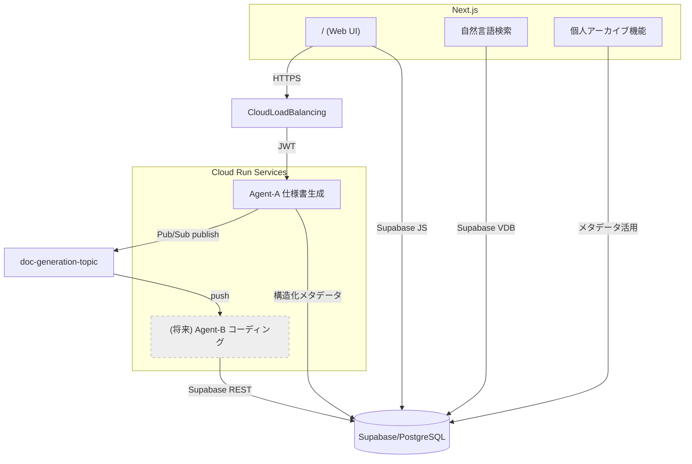

# AutoSpec Generator（自動仕様書生成システム）

自然言語で商品開発のアイデアや要望を伝えたら、AI Agentが自律的に開発に必要な詳細性を維持した高品質ソフトウェア開発仕様書（Markdown）を出力するアプリケーションです。

## 概要

本システムは、ユーザが自然言語で入力した「商品開発アイデア／要望」から、AI Agent が自律的に高品質・網羅的なソフトウェア開発仕様書（Markdown 形式）を生成・保存する Web アプリケーションです。生成された仕様書はライブラリ機能で閲覧・検索でき、開発は全て CLI ベース（gcloud / supabase / firebase / vercel など）で完結する設計です。

## 主要機能

- **AI仕様書生成**: 自然言語の入力から詳細な開発仕様書を自動作成
- **構造化メタデータ**: 仕様書内容を自動分析し、検索可能なメタデータを抽出
- **自然言語検索**: Supabase VDBを利用した意味ベースのベクトル検索機能
- **ハイブリッド検索**: メタデータ、テキスト、ベクトル検索を組み合わせた高精度検索
- **ライブラリ管理**: 生成した仕様書の一覧表示、詳細閲覧
- **アーカイブ機能**: お気に入り登録、メモ追加、個人ライブラリの整理
- **MDダウンロード**: 生成された仕様書をMarkdownファイルとして保存
- **マルチデプロイ環境対応**: GCP, AWS, Azure, Vercelなど複数環境に対応

## システム構成



## 技術スタック

- **フロントエンド**: Next.js 14, Tailwind CSS (白黒2色デザイン)
- **バックエンド**: Node.js 20 + Express (Cloud Run)
- **データベース**: Supabase (PostgreSQL) + Vector Database + MCP
- **認証**: Firebase Authentication (Google/GitHub)
- **AI Model**: OpenAI o3-2025-04-16 (最先端LLM採用)
- **インフラ**: GCP (Cloud Run, Pub/Sub, Secret Manager)
- **CI/CD**: GitHub Actions → Cloud Build → Cloud Run

## 開発仕様書の特徴

Agent-Aが生成する仕様書は、エンジニアリングチームが直ちに開発を開始できる完全性と正確性を持ち、ムダのない設計になっています：

- **統一フォーマット**: 13項目の見出し（概要、目的、システム範囲、ユースケース一覧など）
- **アーキテクチャ図**: Mermaidフローチャートによる視覚的な構成説明
- **詳細なUC設計**: 機能要件を優先度付きユースケースとして明確化
- **実行可能なCLI**: コピペで実行可能な開発手順書
- **環境変数一覧**: .env.example互換の秘匿情報管理
- **CI/CD設計**: GitHub Actions→Cloud Build統合フロー
- **開発計画**: 週単位のWBSとマイルストーン設計

## 自然言語検索機能

Supabase Vector Databaseとハイブリッド検索を組み合わせた高精度検索システムです：

- **ベクトル検索**: OpenAI text-embedding-3-small モデルによる意味的類似性検索
- **メタデータ検索**: 構造化メタデータ（技術スタック、キーワード、アーキテクチャパターンなど）による絞り込み
- **ハイブリッド検索**: 複数の検索方法を組み合わせた高精度な結果提供
- **検索結果スコアリング**: 類似度スコアによる関連度表示
- **フィルタリング機能**: ソフトウェア種別や環境などで絞り込み可能
- **直感的UI**: 自然言語でのフリーフォーム検索

## 個人アーカイブ機能

- **お気に入り管理**: 重要な仕様書をお気に入り登録
- **メモ機能**: 仕様書に対する個人メモの追加・編集
- **MDダウンロード**: 仕様書をMarkdown形式でエクスポート
- **メタデータ表示**: 抽出された構造化メタデータの閲覧

## 開発環境構築

1. リポジトリのクローン
   ```bash
   git clone git@github.com:bonginkan/AutoSpecGenerator.git
   cd AutoSpecGenerator
   ```

2. 環境変数の設定
   ```bash
   cp .env.sample .env.local
   # .env.localに必要な環境変数を設定
   ```

3. フロントエンド（Next.js）の起動
   ```bash
   cd app
   npm install
   npm run dev
   ```

4. Agent-Aのローカル実行
   ```bash
   cp .env.local agents/agent-a/.env  # 環境変数をコピー
   cd agents/agent-a
   npm install
   npm start
   ```

5. Supabaseプロジェクト作成とテーブル設定
   ```bash
   supabase org switch <org>
   supabase projects create autospec-db --region ap-northeast-1
   cat infra/supabase_schema.sql | supabase db sql
   ```

詳細な設計ドキュメントは [basic_design.md](./basic_design.md) を参照してください。

## デプロイ

GCPへのデプロイ手順は、`basic_design.md` の「8. 開発手順書」セクションを参照してください。

## 管理者情報

- プロジェクト管理: ボンギンカン株式会社
- ウェブサイト: [https://bonginkan.ai/](https://bonginkan.ai/)
- 連絡先: t@bonginkan.ai

## ライセンス

本ソフトウェアはボンギンカン株式会社の独自ライセンスに基づいて提供されています。詳細は [LICENSE.md](./LICENSE.md) を参照してください。

© 2025 ボンギンカン株式会社 (Bonginkan Inc.) All rights reserved. 