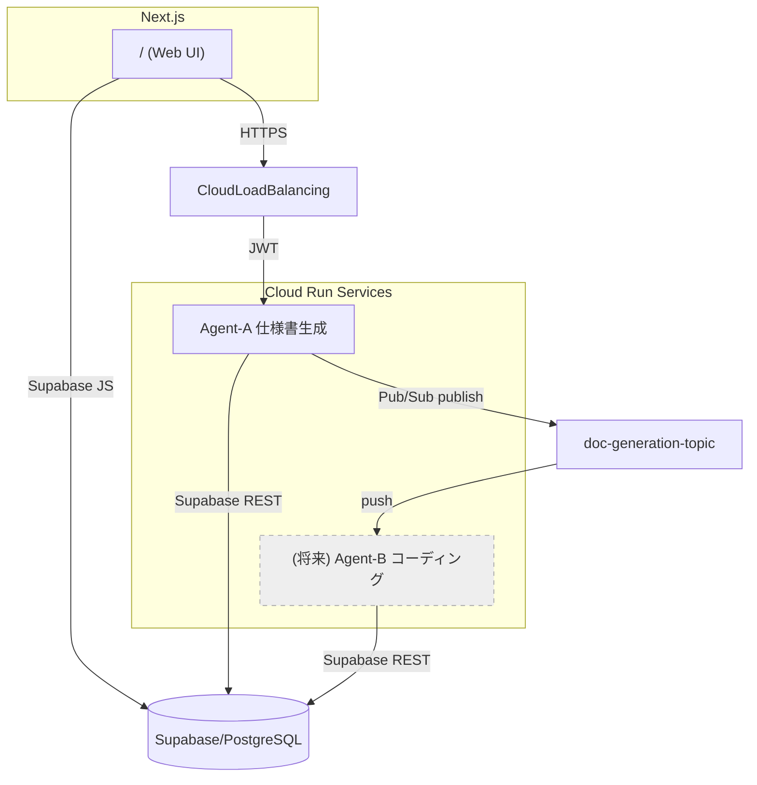

# AutoSpec Generator（自動仕様書生成システム）

自然言語で商品開発のアイデアや要望を伝えたら、AI Agentが自律的に開発に必要な詳細性を維持した高品質ソフトウェア開発仕様書（Markdown）を出力するアプリケーションです。

## 概要

本システムは、ユーザが自然言語で入力した「商品開発アイデア／要望」から、AI Agent が自律的に高品質・網羅的なソフトウェア開発仕様書（Markdown 形式）を生成・保存する Web アプリケーションです。生成された仕様書はライブラリ機能で閲覧・検索でき、開発は全て CLI ベース（gcloud / supabase / firebase / vercel など）で完結する設計です。

## システム構成



## 技術スタック

- **フロントエンド**: Next.js 14, Tailwind CSS (白黒2色デザイン)
- **バックエンド**: Node.js 20 + Express (Cloud Run)
- **データベース**: Supabase (PostgreSQL) + MCP
- **認証**: Firebase Authentication (Google/GitHub)
- **AI Model**: OpenAI o3-2025-04-16 / Google Gemini
- **インフラ**: GCP (Cloud Run, Pub/Sub, Secret Manager)

## 開発環境構築

1. リポジトリのクローン
   ```bash
   git clone git@github.com:YOUR_USERNAME/AutoSpecGenerator.git
   cd AutoSpecGenerator
   ```

2. 環境変数の設定
   ```bash
   cp .env.sample .env.local
   # .env.local に必要な環境変数を設定
   ```

3. フロントエンド（Next.js）の起動
   ```bash
   cd app
   npm install
   npm run dev
   ```

4. Agent-Aのローカル実行
   ```bash
   cd agents/agent-a
   npm install
   npm start
   ```

5. Supabaseプロジェクト作成とテーブル設定
   ```bash
   supabase org switch <org>
   supabase projects create autospec-db --region ap-northeast-1
   cat infra/supabase_schema.sql | supabase db sql
   ```

詳細な設計ドキュメントは [basic_design.md](./basic_design.md) を参照してください。

## デプロイ

GCPへのデプロイ手順は、`basic_design.md` の「8. 開発手順書」セクションを参照してください。

## 管理者情報

プロジェクト管理者: t@bonginkan.ai

## ライセンス

プロプライエタリ (独自ライセンス) 