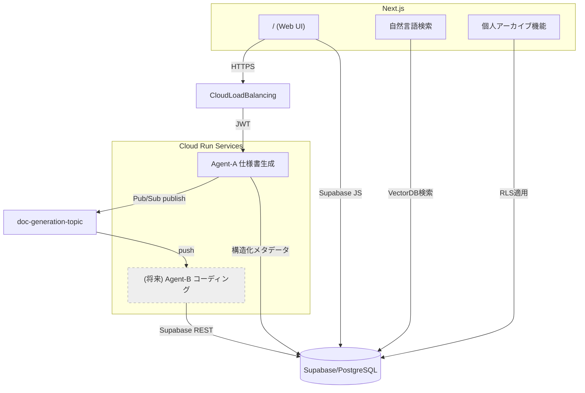

# AI-Powered Development Specification Generation System – Basic Design Document

---

## 1. 概要（Overview）
本システムは、ユーザが自然言語で入力した「商品開発アイデア／要望」から、AI Agent が自律的に高品質・網羅的なソフトウェア開発仕様書（Markdown 形式）を生成・保存する Web アプリケーションである。生成された仕様書はライブラリ機能で閲覧・検索でき、生成時に抽出された構造化メタデータを活用した高度な検索や個人アーカイブ機能を提供する。開発は全て CLI ベース（gcloud / supabase / firebase / vercel など）で完結する設計とする。

---

## 2. 目的（Purpose）
1. 企画フェーズの言語化コストを削減し、開発着手までのリードタイムを最短化する。
2. AI Agent によりヒューマンエラーを最小化した一貫性の高いドキュメントを提供する。
3. ベクトル検索とメタデータ抽出により、生成された仕様書の検索可能性と再利用性を向上させる。
4. Function Calling による構造化メタデータ抽出により、仕様書の意味的理解と分析を可能にする。
5. Pub/Sub を介したマイクロサービス化により Agents の水平スケール・機能拡張を容易にする。

---

## 3. フレームワーク & 技術スタック
| レイヤ | 採用技術 | 理由 |
| --- | --- | --- |
| フロントエンド | Next.js 14 (App Router) | SPA/SSR ハイブリッド, 高速開発 |
| UI コンポーネント | Tailwind CSS + Headless UI | モダン・白黒 2 色デザイン |
| 認証 | Firebase Authentication (Google / GitHub) | Cloud Run との連携容易 |
| バックエンド | Cloud Run（Node.js 20） | コンテナ化 & オートスケール |
| Message Bus | Cloud Pub/Sub | 非同期 A2A 通信 |
| DB | Supabase (PostgreSQL) on GCP | OSS, Row‑Level Security, Vector Store |
| ベクトル検索 | Supabase Vector Database | 自然言語による意味的検索 |
| ナレッジ検索 | Supabase MCP | Embedding & NL 検索 |
| AI モデル | OpenAI o3‑2025‑04‑16 | 高精度 LLM |
| メタデータ抽出 | OpenAI Function Calling | 構造化データ生成 |
| IaC | gcloud CLI / Terraform（将来） | 再現性、CI/CD |
| Monitoring | Cloud Logging / Cloud Monitoring | SRE |

---

## 4. アーキテクチャ（Architecture）



### コンポーネント説明
1. **Frontend (Next.js)**：ログイン、入力フォーム、マイページ、ライブラリ UI を提供。Firebase Auth ID トークンを Cloud Run へ送信。
2. **Agent‑A**：今回実装対象。入力文から仕様書を生成し `spec_documents` テーブルへ保存。Function Calling でメタデータを抽出。必要に応じ Pub/Sub で次工程にパブリッシュ。
3. **Supabase**：PostgreSQL + Storage + Vector Database。pgvector 拡張とメタデータによるハイブリッド検索 API を提供。
4. **Cloud Pub/Sub**：Agent 間の疎結合通信。Push サブスクリプションで Cloud Run エンドポイントに POST。
5. **自然言語検索**：Supabase Vector Database を活用し、ベクトル検索と構造化メタデータを組み合わせたハイブリッド検索を実現。
6. **個人アーカイブ**：ユーザーごとの仕様書アーカイブ、お気に入り機能、メモ機能を提供。

---

## 5. ディレクトリ構成（Monorepo）
```
AutoSpecGenerator/
├── app/                     # Next.js (frontend)
│   ├── src/
│   │   ├── app/
│   │   │   ├── library/
│   │   │   │   ├── search/  # 自然言語検索ページ
│   │   │   │   │   └── page.tsx
│   │   │   │   └── page.tsx
│   │   │   ├── archives/    # 個人アーカイブページ
│   │   │   │   └── page.tsx
│   │   │   ├── spec/        # 仕様書詳細表示
│   │   │   │   └── [id]/
│   │   │   │       └── page.tsx
│   │   │   └── ...
│   │   └── components/
│   │       ├── SearchBar.tsx  # 検索コンポーネント
│   │       └── ...
├── agents/
│   ├── agent-a/
│   │   ├── Dockerfile
│   │   ├── index.js
│   │   ├── package.json
│   │   └── prompts/
│   │       └── system_prompt.txt
│   ├── agent-b/             # 予備フォルダ（未実装）
│   └── agent-c/             # 〃
├── infra/                   # gcloud スクリプト / Terraform
│   └── supabase_schema.sql  # スキーマ & インデックス定義
├── docs/
│   └── diagrams/
├── LICENSE.md               # プロプライエタリライセンス
├── mcp.json                 # Supabase MCP 設定
└── README.md
```

---

## 6. 機能要件（Functional Requirements）
1. **仕様書生成**
   - 入力：自然言語テキスト（必須）、Deploy 環境選択（Vercel/GCP/AWS/Azure）、ソフトウェア種別（Web App / AI Agent）
   - 出力：Markdown 仕様書 `title_basic_design.md`、構造化メタデータ
   - 保存：Supabase `spec_documents` テーブル
   - 形式：先頭行は `# <自動生成タイトル> 基本設計書`、13 見出し順守
   - 品質：不確定事項は `TODO:` ラベル付けし、洗い出し
2. **メタデータ抽出**
   - Function Calling による構造化メタデータ生成
   - 抽出項目：タイトル、要約、キーワード、技術スタック、アーキテクチャパターン、デザインパターン
   - 技術スタックの詳細分類：フロントエンド、バックエンド、インフラ、言語など
3. **ライブラリ閲覧**
   - 自ユーザの仕様書一覧/詳細表示、Delete
   - MDファイルとしてのダウンロード機能
4. **個人アーカイブ機能**
   - 仕様書のお気に入り登録/解除
   - 仕様書に対するメモ追加・編集
   - お気に入りフィルター表示
5. **自然言語検索**
   - ハイブリッド検索：ベクトル検索 + メタデータ検索 + テキスト検索
   - キーワードだけでなく文脈的な検索クエリをサポート
   - 類似度スコアによるランキング表示
   - フィルタリング（日付、種別、環境、技術スタック）と併用可能
6. **認証／認可**
   - Google / GitHub ログイン
   - RLS：運営 Admin（`t@bonginkan.ai`）は全件読取
7. **Secrets 管理**
   - OPENAI_API_KEY, SUPABASE_SERVICE_KEY, GITHUB_PAT などを Secret Manager に保存
8. **CLI 自動化**
   - Cloud Build YAML or Makefile によりローカル CLI 手順を再現

---

## 7. 非機能要件（Non‑Functional Requirements）
| 項目 | 内容 |
| --- | --- |
| 可用性 | Cloud Run min = 0, concurrency = 80, Multi‑Zone |
| パフォーマンス | 仕様書生成 < 30 s, 検索応答 < 2 s |
| セキュリティ | HTTPS, IAM, RLS, Secrets Manager |
| スケーラビリティ | Pub/Sub & Cloud Run により水平拡張 |
| 監視 | Cloud Monitoring アラート, Error Reporting |
| 運用 | GitHub Actions → Cloud Build / Deploy |
| ライセンス | ボンギンカン株式会社プロプライエタリライセンス |

---

## 8. 開発手順書（High‑Level Steps）
1. **ローカル準備**
   ```bash
   git clone git@github.com:bonginkan/AutoSpecGenerator.git
   cd AutoSpecGenerator
   cp .env.sample .env.local  # 秘密値を記入するローカル専用ファイル
   npx supabase start # ローカル確認用
   ```
2. **GCP 初期化**
   ```bash
   gcloud auth login
   gcloud config set project <PROJECT_ID>
   gcloud services enable run.googleapis.com pubsub.googleapis.com secretmanager.googleapis.com
   ```
3. **Secrets 登録**
   ```bash
   gcloud secrets create OPENAI_API_KEY --replication-policy="automatic"
   echo -n "$OPENAI_API_KEY" | gcloud secrets versions add OPENAI_API_KEY --data-file=-
   ```
4. **Supabase プロジェクト作成 & MCP 追加**
   ```bash
   supabase org switch <org>
   supabase projects create <db-id> --region ap-northeast-1
   npm i -g @supabase/mcp-server-supabase
   # mcp.jsonを作成して設定
   ```
5. **Supabase ベクトル検索設定**
   ```bash
   # pgvector拡張を有効化
   cat << 'EOF' | supabase db sql
   CREATE EXTENSION IF NOT EXISTS vector;
   ALTER TABLE spec_documents ADD COLUMN IF NOT EXISTS content_embedding vector(1536);
   ALTER TABLE spec_documents ADD COLUMN IF NOT EXISTS metadata jsonb DEFAULT '{}'::jsonb;
   CREATE INDEX IF NOT EXISTS spec_documents_content_embedding_idx ON spec_documents USING ivfflat (content_embedding vector_l2_ops);
   CREATE INDEX IF NOT EXISTS spec_documents_metadata_idx ON spec_documents USING GIN (metadata);
   EOF
   ```
6. **Agent‑A デプロイ**
   ```bash
   gcloud builds submit ./agents/agent-a --tag gcr.io/$PROJECT_ID/agent-a
   gcloud run deploy agent-a \
     --image gcr.io/$PROJECT_ID/agent-a \
     --platform managed \
     --region asia-northeast1 \
     --set-secrets "OPENAI_API_KEY=projects/$PROJECT_ID/secrets/OPENAI_API_KEY:latest" \
     --allow-unauthenticated
   ```
7. **Pub/Sub トピック & Push サブスクリプション作成**
   ```bash
   gcloud pubsub topics create doc-generation-topic
   gcloud pubsub subscriptions create agent-a-sub \
     --topic=doc-generation-topic \
     --push-endpoint="https://agent-a-<hash>-uc.a.run.app/" \
     --push-auth-service-account="agent-a-sa@$PROJECT_ID.iam.gserviceaccount.com"
   ```

---

## 9. 開発計画（Milestones）
| Phase | 期間 | Deliverables |
| --- | --- | --- |
| 0. Kick‑off | Wk‑0 | 本ドキュメント承認 |
| 1. 基盤構築 | Wk‑1〜2 | GCP / Supabase / Firebase 初期設定 |
| 2. Agent‑A 実装 | Wk‑3〜4 | 仕様書生成 API＆UI 完了 |
| 3. メタデータ抽出 | Wk‑4 | Function Callingによる構造化データ生成 |
| 4. ライブラリ & 検索 | Wk‑5 | VDB組込み, ハイブリッド検索機能 |
| 5. アーカイブ機能 | Wk‑5~6 | お気に入り、メモ、個人ライブラリ |
| 6. QA / Hardening | Wk‑6 | 負荷試験, 脆弱性診断 |
| 7. リリース | Wk‑7 | v1.0 GA |

---

## 10. 拡張機能（Future Work）
- Agent‑B：生成仕様書 → コードベース scaffold（Next.js + Prisma など）
- Agent‑C：E2E Test / CI 設定自動生成
- Multi‑Cloud deploy (AWS Amplify, Azure Static Web Apps)
- ChatOps（Slack Bot）経由でアイデア投稿
- 高度な類似度検索・レコメンデーション機能
- 仕様書データからのAI学習によるレコメンデーション強化

---

## 11. 環境変数（Secrets）一覧
| Key | 用途 | サンプル値 | Scope |
| --- | --- | --- | --- |
| OPENAI_API_KEY | o3 API 呼び出し | YOUR_OPENAI_KEY | Server |
| GEMINI_API_KEY | Google GenAI (Gemini) 呼び出し | YOUR_GEMINI_KEY | Server |
| SUPABASE_URL | Supabase REST URL | https://xxx.supabase.co | All |
| SUPABASE_SERVICE_KEY | サーバ側管理キー | YOUR_SUPABASE_KEY | Server |
| SUPABASE_ANON_KEY | クライアント側公開キー | YOUR_PUBLIC_KEY | Client |
| SUPABASE_MCP_TOKEN | Supabase MCP サービス用トークン | sbp_xxxx | Dev |
| GITHUB_PAT | GitHub Actions / gh CLI 認証 | YOUR_GITHUB_PAT | CI/CD |
| GOOGLE_APPLICATION_CREDENTIALS | Cloud SDK SA JSON | /path/to/key.json | Server |

---

## 12. Supabase MCP 設定
`mcp.json` ファイルを使用し、ローカル開発環境とAIアシスタント（Cursor）での連携を実現する。

```json
{
  "mcpServers": {
    "supabase": {
      "command": "npx",
      "args": [
        "-y",
        "@supabase/mcp-server-supabase@latest",
        "--access-token",
        "sbp_9b90e5ab73e1c568aabda1b2ba8098bc2de7e95c"
      ]
    }
  }
}
```

Supabase MCPを使用することで、以下の機能が利用可能：
1. AI アシスタントからSupabaseへのアクセス
2. `execute_sql` ツールによるベクトル検索クエリの実行
3. スキーマ情報の取得とTypeScript型定義の生成

---

## 13. Agent‑A システムプロンプト

Agent-Aは、ユーザーの自然言語入力から高品質な仕様書を生成するよう設計されています。プロンプトの主要ポイント：

1. **明確な役割**: エンジニアリングチームが直ちに開発開始できる完全・正確な仕様書を生成
2. **統一フォーマット**: 13項目の見出し（概要、目的、システム範囲など）を順守
3. **アーキテクチャ図**: Mermaid flowchartによる視覚化（唯一のコードブロック）
4. **品質保証**: 実行可能なCLIコマンド、環境変数表、開発計画など実践的な内容
5. **自己評価機能**: 生成前に13項目のチェックリストで仕様書の完全性を検証

詳細は `agents/agent-a/prompts/system_prompt.txt` を参照してください。

---

## 14. Agent‑A コード一式

Agent-Aの実装コードは `agents/agent-a/` ディレクトリに格納されています。主要コンポーネント：

1. **Dockerfile**: Node.js 20ベースのコンテナ定義
2. **index.js**: Express APIサーバー、OpenAI呼び出し、Supabase連携
3. **extractMetadata()**: Function Callingによる構造化メタデータ抽出機能
4. **system_prompt.txt**: 仕様書生成のためのシステムプロンプト

---

## 15. Supabase スキーマ定義

PostgreSQLスキーマ定義は `infra/supabase_schema.sql` に格納されています。主要テーブル：

1. **spec_documents**: 仕様書本体とメタデータを管理
   - 構造化メタデータ（JSONB形式）
   - ベクトル埋め込み（OpenAI embedding）
   - Row-Level Security（ユーザー別アクセス制御）

2. **user_archives**: ユーザー別のアーカイブを管理
   - お気に入りフラグ
   - ユーザーメモ
   - 仕様書への外部キー参照

ハイブリッド検索用のPostgreSQL関数も定義されています。

---

## 16. フロントエンド実装

Next.js App Routerを使用したフロントエンド実装。主要コンポーネント：

1. **SpecDetailPage**: 仕様書詳細表示、Markdownレンダリング、メタデータ表示
2. **SearchBar**: インクリメンタルな自然言語検索
3. **SearchPage**: 高度な検索機能とフィルタリング
4. **ArchivesPage**: 個人アーカイブ管理

UI設計は白黒2色を基調としたミニマリストデザインを採用し、視認性と操作性を重視。

---

## 17. ベクトル検索実装

Supabase Vector Database (pgvector) を活用したハイブリッド検索システム：

1. **テキスト検索**: 通常のキーワードマッチング
2. **ベクトル検索**: 埋め込みによる意味的類似性
3. **メタデータ検索**: 構造化データに基づく絞り込み
4. **ハイブリッド検索**: 複数手法の組み合わせによる高精度化

これによりユーザーは自然言語で直感的に仕様書を検索できます。 